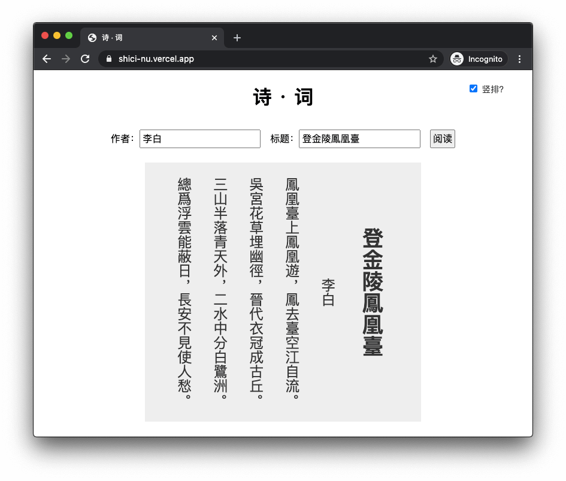

# 诗 · 词

一个用来查看诗词的网页：

https://shici-nu.vercel.app/



只支持「作者」+「标题」的精确匹配，且查看诗时需要用繁体，而查看词时需要用简体，上游 [chinese-poetry](https://github.com/chinese-poetry/chinese-poetry) 原始数据如此，本来想试试用 opencc 转换的，但安装出错，暂时放弃。

## API

和上面网页一样，只支持「作者」+「标题」的精确匹配，URL 举例：

https://shici-nu.vercel.app/api/search?author=杜甫&title=春望

```
 $ curl 'https://shici-nu.vercel.app/api/search?author=杜甫&title=春望'
{
  "author": "杜甫",
  "paragraphs": [
    "國破山河在，城春草木深。",
    "感時花濺淚，恨別鳥驚心。",
    "烽火連三月，家書抵萬金。",
    "白頭搔更短，渾欲不勝簪。"
  ],
  "tags": [
    "唐诗三百首",
    "战争",
    "忧国忧民",
    "爱国",
    "五言律诗",
    "初中古诗",
    "八年级上册(课内)",
    "思乡",
    "写鸟",
    "鸟"
  ],
  "title": "春望",
  "id": "e9e6425c-6c14-4f69-8694-87a8b96a43de"
}
```

获得随机一首诗词：

https://shici-nu.vercel.app/api/random

API 支持支持 CORS。

## 数据来源

https://github.com/chinese-poetry/chinese-poetry 中的「诗」和「词」。

## 网站托管

网站托管在 Vercel，使用它的 Serverless Function。数据库服务采用 MongoDB Atlas。这两项服务都是免费的。
